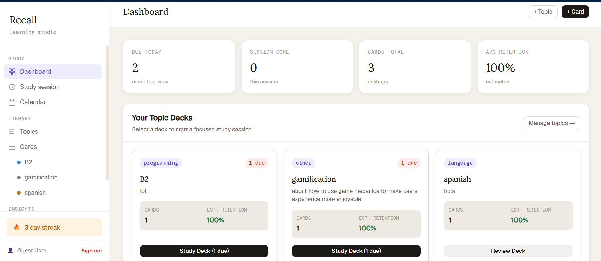
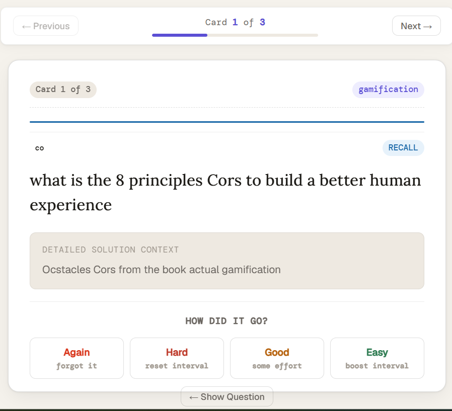
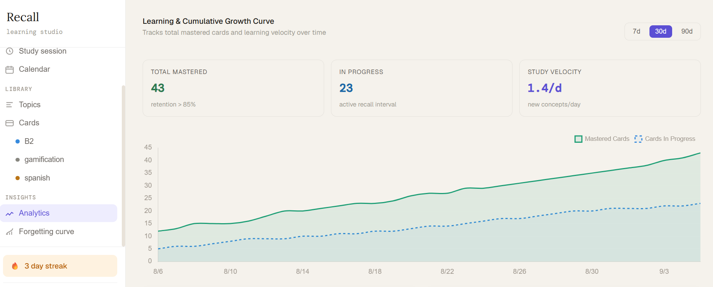
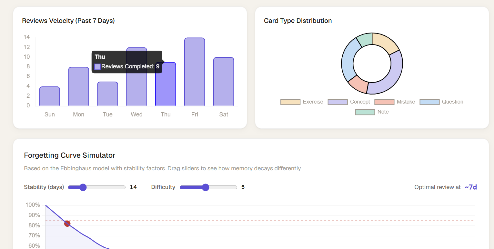
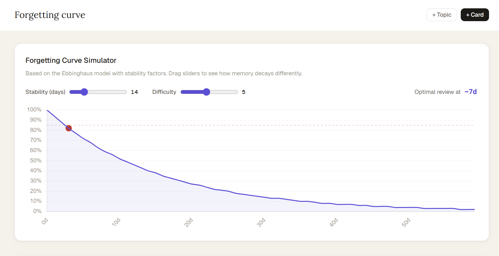

<h1 align="center">Recall — Intelligent Spaced Repetition Platform</h1>

<p align="center">
  <em>A full-stack learning platform powered by the **FSRS : <a href="https://github.com/open-spaced-repetition/free-spaced-repetition-scheduler">Free Spaced Repetition Scheduler algorithm</a>** — a machine-learning-derived memory model that predicts optimal review timing to maximize long-term retention.</em>
</p>

<p align="center">
  
  
  
  
  
  
  
</p>

---


## About

Unlike standard flashcard applications that rely on static intervals, Recall uses a machine-learning-derived memory model to predict exactly when you are about to forget a piece of information. 

By analyzing your review history, the system dynamically computes per-card stability, difficulty, and retrievability. It then schedules future reviews at the mathematically optimal moment to maintain a target retention rate (defaulting to 90%), ensuring you spend time only on the material that actually needs reviewing.

---

## Screenshots

### Dashboard — Study Hub & Deck Management
> Real-time KPIs (cards due, retention rate, session progress) with topic deck cards showing per-deck retention estimates and review counts.



---

### Study Session — FSRS-Powered Flashcard Review
> Active recall interface with 4-grade FSRS rating system (Again / Hard / Good / Easy). Each rating triggers the FSRS algorithm to recompute stability, difficulty, and the next optimal review date.



---

### Analytics — Learning & Cumulative Growth Curve
> Tracks mastered cards vs. cards in progress over time with study velocity metrics. KPI cards show total mastered count, active recall items, and daily learning rate.



---

### Analytics — Review Velocity & Card Distribution
> Weekly review heatmap (bar chart) alongside a card-type distribution breakdown (Exercise, Concept, Mistake, Question, Note). Includes an interactive Forgetting Curve Simulator.



---

### Forgetting Curve Simulator
> Interactive visualization of the Ebbinghaus forgetting curve with FSRS stability factors. Adjustable sliders for Stability (days) and Difficulty dynamically render the memory decay function and compute the optimal review point.



---


## Core Algorithm — FSRS (Free Spaced Repetition Scheduler)

The FSRS algorithm is a **machine-learning-based memory model** that replaces traditional SM-2 style heuristics with a mathematically rigorous approach:

| Concept | Description |
|---|---|
| **Stability (S)** | The number of days after which retrievability drops to 90%. Trained via gradient descent. |
| **Difficulty (D)** | A per-card difficulty score (1–4) that influences how quickly stability grows. |
| **Retrievability (R)** | The probability of successful recall at time *t*: `R(t, S) = (1 + 0.9803 × t/S)^(-0.1542)` |
| **State Machine** | Cards transition through `Learning → Review → Relearning` based on ratings and lapse detection. |
| **21 Parameters** | Model weights optimized on large-scale review datasets using stochastic gradient descent. |
| **Target Retention** | Configurable per-user (default 90%). The scheduler solves for the interval where R = target. |

---

## Tech Stack

| Layer | Technology | Purpose |
|---|---|---|
| **Frontend** | React 19, Vite 8 | Component-based SPA with hot module replacement |
| **Data Visualization** | Chart.js, react-chartjs-2 | Growth curves, bar charts, doughnut charts, forgetting curves |
| **Backend Framework** | Django 6.0, Django REST Framework | RESTful API, ORM, admin, migrations |
| **Memory Algorithm** | py-fsrs | FSRS v5 scheduler with configurable 21-parameter model |
| **Authentication** | SimpleJWT | Access/refresh token pair with secure CORS configuration |
| **Database** | SQLite | Relational storage for cards, review logs, scheduler configs |
| **Testing** | Vitest, Django TestCase | Frontend unit tests, backend API integration tests |
| **Linting** | OxLint | Fast Rust-based JavaScript linter |

---

## API Endpoints

| Method | Endpoint | Description |
|---|---|---|
| `GET/POST` | `/api/cards/` | List cards (with filters: topic, type, date, exam, difficulty) or create a new card |
| `GET/PUT/DELETE` | `/api/cards/<id>` | Retrieve, update, or delete a specific card |
| `POST` | `/api/cards/<id>/ratings/<rating>/<duration_ms>/` | Submit a review — triggers FSRS recalculation and logs the review |
| `GET` | `/api/cards/today/` | Get all cards due for review today |
| `GET/POST` | `/api/topics/` | List or create topic decks |
| `GET` | `/api/exams/` | List exams with associated topics |
| `GET` | `/api/analytics/` | Computed analytics: retention rate, cards studied, upcoming workload |
| `POST` | `/api/token` | Obtain JWT access + refresh token pair |
| `POST` | `/api/token/refresh` | Refresh an expired access token |

---

## Project Structure

```text
spaced_learning_website/
├── Backend/
│   ├── config/              # Django settings, URL routing, WSGI/ASGI
│   ├── card/
│   │   ├── models.py        # Data models: Card, Topic, ReviewLog, Exam, Scheduler_settings
│   │   ├── views.py         # API views: CRUD, FSRS review flow, analytics engine
│   │   ├── serializers.py   # DRF serializers for JSON serialization
│   │   └── tests.py         # Backend test suite
│   └── manage.py
│
├── Frontend/
│   ├── src/
│   │   ├── App.jsx          # Main app with routing and state management
│   │   ├── components/      # Reusable UI components
│   │   ├── views/           # Page-level views (Dashboard, Study, Analytics)
│   │   ├── services/        # API client layer
│   │   └── styles/          # CSS modules and design tokens
│   ├── package.json
│   └── vite.config.js
│
├── assets/                  # Project screenshots and documentation media
└── test/                    # Project-level test configurations
```


---

## License

This project is open source and available under the [MIT License](LICENSE).


<p align="center">
  <strong>Built with ❤️ to learn, retain, and never forget.</strong>
</p>
